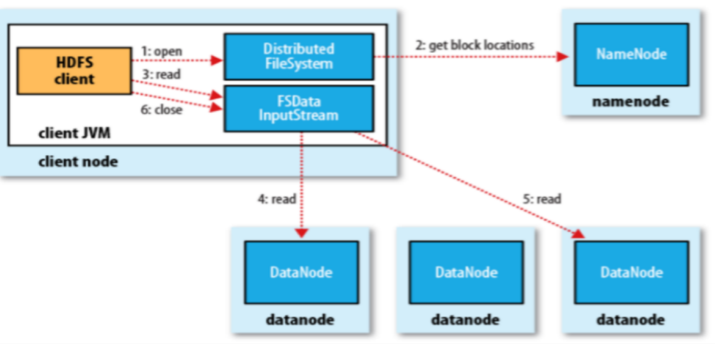
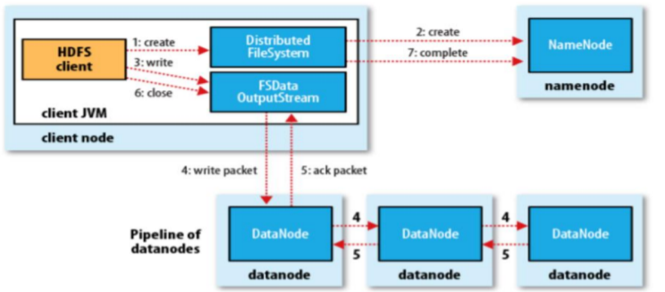

# 大数据概况及Hadoop生态系统

   ##    bigdata

* Objective
    + 了解大数据概论及属性
    + 了解大数据分布式处理的基本方法!
    + 了解Hadoop生态系统!
    + 理解Hadoop架构及核心模块!
    + 掌握HDFS基本文件操作命令!
    + 掌握用Java实现HDFS文件读写

* Two Inherent Characteristics 两个固有的特征
    + Time-based 数据产生的时间
    + Immutable 数据的不可变性，变化后视为新的数据，不是更新

* Traditional Distributed Computing 传统分布式计算
    + 机器计算能力能受限于cpu
    + 数据量相对较小
    + 对数据进行大量复杂处理

* New Distributed Computing - Hadoop 新的分布式运算-Hadoop
    + Distribute Data Storage 数据是分布式存储的
    + 构建商业集群的成本较低
    + 算法支持并行运算
    + 将程序分发到数据节点

## Hadoop

* The Apache™ Hadoop®是一个可靠的，可伸缩的，开源的分布式计算软件

* Hadoop Architecture Hadoop架构

    - Hadoop Common: (Hadoop公共框架)

        - Common Utilities that supports all other modules. (支持所有其他模块的Common Utilities)

    - Hadoop Distributed File System (HDFS):

        - File system that spans all the nodes in a Hadoop cluster for data storage. – Links the file systems
        on local nodes to make them into one big file system. (跨越Hadoop集群中所有节点以进行数据
        存储的文件系统,链接本地节点上的文件系统，使它们成为一个大文件系统)

    - Hadoop MapReduce:

        - Core computing framework available since Hadoop 1.x (自Hadoop 1.x以来可用的核心计算框
        架)
        - 1.x版本的mapreudce需要负责处理业务逻辑，还要负责资源管理和任务调度
    - Hadoop YARN: (资源管理器)
        - New distributed processing framework on Hadoop 2.x. (Hadoop 2.x上的新分布式处理框架)
        - Addresses multiple limitations of MR 1.0 (解决了MR 1.0的多种限制)
        - 2.x资源管理和任务调度由YARN来管理
        - hadoop2.x版本出现了新的应用模型Tez
    - Hadoop Ecosystem: (hadoop生态圈)
        - – Open-source Apache projects (开源的Apache项目集合)
    
* 纠错码技术
    - 纠删码技术（Erasure coding）简称EC，是一种编码容错技术。最早用于通信行业，数据传输中的数
    据恢复。它通过对数据进行分块，然后计算出校验数据，使得各个部分的数据产生关联性。当一部分数
    据块丢失时，可以通过剩余R的数据块和校验块计算出丢失的数据块

## HDFS Roles

- NameNode (NN)
    - Manages the File System's namespace/meta-data/file blocks (管理文件系统命名空间/元数据/文
    件块)
    - Runs on 1 machine to several machines (在一台机器上运行到几台机器)
- Secondary NameNode (SNN)（了解）
    - Performs house keeping work so NameNode doesn’t (执行备份工作，因此NameNode不会)
    - Requires similar hardware as NameNode machine (需要与NameNode机器类似的硬件)
    - Not used for high-availability – not a backup for NameNode (不用于高可用性 - 不是NameNode的
    备份)
- DataNode (DN)
    - Stores and retrieves data blocks (存储和处理数据)
    - Reports to NameNode (报告给NameNode)
    - Runs on many machines (在许多机器上运行)

## Hadoop (HDFS) Components 组件

* Client
    - User/App interface to interact with cluster, DN (用户/应用程序界面与群集，DN进行交互)
* Namespace
    - Files/Directories - Same to the regular file systems split into blocks (文件/目录 - 与拆分为块的
    常规文件系统相同)
    - Blocks
        - Default: 64M (v1); 128M (v2)
        - Blocks meta data kept in NN – Small files issue (阻止在NN中保存的元数据 - 小文件问题)
    - Block Storage:
        - Replications
            - Default 3 and rebalanced for new added nodes (默认值为3，并为新添加的节点重新
            平衡)
            - 1st replica on the local. 2nd on the local but different node. 3rd on the different rack(当
            地的第一个复制品。 在本地但不同的节点上排名第二。 第三个在不同的机架上)

## Hadoop High Availability(高可用性)
* HDFS联合通过在多个分隔的NameNode上对文件系统命名空间进行分区
- Active and Standby NNs share the storage for edit logs; (共享存储以进行编辑日志)

## Read File

## Write File

## Hdfs Command Examples 命令样例

* 官方命令

[URL](https://hadoop.apache.org/docs/current/hadoop-project-dist/hadoop-hdfs/HDFSCommands.html)